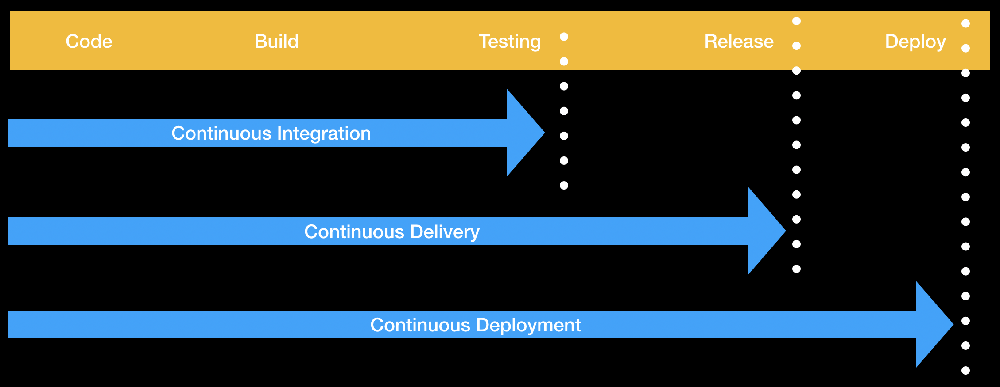
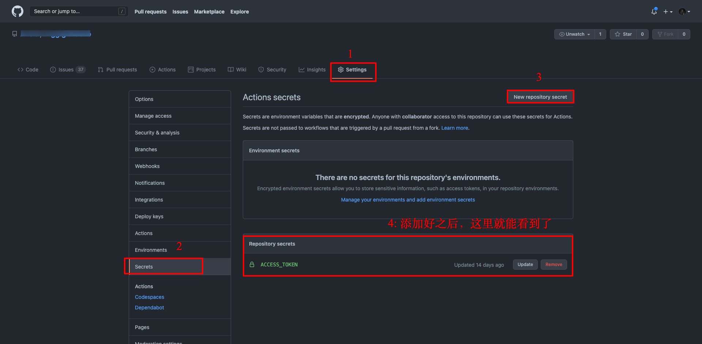

这个博客站是我自己用 Gatsby 随便拼凑了一下造出来的，前几天发现好久都没有更新博客了，心里还是很愧疚的 🤣，那就更新一篇吧。

之前用 Gatsby 写博客要么是在 OS 系统下，要么是在 Linux 系统下，从来没用过 Windows。但是由于工作环境的变化，手头只有 Windows 可用，讲道理这种纯前端该没什么平台限制，但是在我一通 `npm` 命令之后，博客并没有按照我的预期正常跑起来，这里不对这个问题做深究（Windows 文件路径大小写不敏感，而且盘符根目录都是大写字母 C D E，会导致 Gatsby 脚手架部分功能异常）。

经过一番努力之后，终于正常跑起来了，但是由于使用的 Windows 系统配置特别差，CPU 动不动就要飙到 100%，Gatsby 最终生成静态站点的过程及其痛苦。

<<<<<<< HEAD
由于所在网络环境的问题，最终将生成的静态内容推送到 Github Pages 服务的过程也是很糟心 😢。
=======
由于所在网络环境的问题，最终将生成的静态内容推送到 Github Pages 服务的过程也是很糟心😢。
>>>>>>> cbbba62... a写一半换电脑

遂决定，使用 Github Actions 自动打包自动部署。趁有空花了一下午时间，把 Github Lab 中的 Github actions 的内容都过了一遍，这里就做个简单的记录。

## Github Actions 简介

> Automate, customize, and execute your software development workflows right in your repository with GitHub Actions. You can discover, create, and share actions to perform any job you'd like, including CI/CD, and combine actions in a completely customized workflow.

Github Actions 可以粗略的理解为集成在 Github 中的 CI/CD 服务， 和 Jenkins、Travis CI 等类似。



Github Actions 目前可以用来做以下这些事情：
<<<<<<< HEAD

- 自动化测试（持续集成）
- 持续交付和部署
- 触发 Code Review
- 管理分支
- 分类 Issue 和 PR

简单的来说，就是之前我们需要在本地电脑上进行的 `npm run build` `npm run test`，都可以通过使用 Github Actions 在云平台中进行，而且在打包和测试完成之后，还能自动帮你进行部署。

这就意味着，我们不需要自己购买以及配置相关的构建服务器，Github 提供了免费云环境供大家使用。而且，由于是和 Github 集成的，所有的工作流都可以设置 Github 相关事件触发（push, issues, label, pull request 等等）。

在 Gihub 中有一个 [Action 市场](https://github.com/marketplace?type=actions)，还有别人整理的一个 [Awesome Acitons](https://github.com/sdras/awesome-actions)，里面有很多别人已经写好的 Action，可以直接拿过来用，不要太爽。

## 快速入门

### 准备工作

你需要一个 Github 仓库，新建一个仓库，或者使用一个已有的仓库都可以。

### 创建你的第一个 workflow 文件

在你的本地仓库根目录创建 `.github/workflows` 文件夹，使用 Windows 操作系统的同学自行创建，Linux 操作系统的同学可以使用下面的命令。（当然你也可以不使用本地仓库，直接在 Github 网页中进行创建文件的操作）

```bash
mkdir -p .github/workflows
cd .github/workflows
```

创建文件 `your-first-workflow.yml`

```bash
touch your-first-workflow.yml
```

将下面的内容复制到你的 `your-first-workflow.yml` 文件中，并保存。

```yaml
name: GitHub Actions Demo
on: [push]
jobs:
  Explore-GitHub-Actions:
    runs-on: ubuntu-latest
    steps:
      - run: echo "🎉 你的工作流被 ${{ github.event_name }} 事件自动触发了."
      - run: echo "🐧 本工作流运行在 Github 托管的 ${{ runner.os }} 服务器上!"
      - run: echo "🔎 你的分支名是 ${{ github.ref }}，你的 github 仓库是 ${{ github.repository }}."
      - name: Check out repository code
        uses: actions/checkout@v2
      - run: echo "💡 仓库 ${{ github.repository }} 已经被克隆到 ubuntu 了"
      - run: echo "🖥️ 工作流已经准备好在 ubuntu 上对你的代码进行测试了"
      - name: List files in the repository
        run: |
          ls ${{ github.workspace }}
      - run: echo "🍏 当前工作流的状态是 ${{ job.status }}."
```

将当前改动推送到你的 Github 仓库中。（如果你是 Github 页面直接新建文件操作的直接跳过）

```bash
git add .
git push -u 你的仓库地址 master
```

然后打开 Github 中的 Actions 页面，你会发现你的工作流已经在运行了。

## Github Actions 基本概念

- workflow(工作流)：每个 workflow 文件就代表一个工作流，会在特定的条件下触发。
- jobs(工作)：一个工作流中可以包含很多工作，字面意思很好理解（乔布斯哈哈哈）
- steps(步骤)：每个工作可以有很多步骤组成
- action(行为)：每个步骤中可以执行一个或多个行为（或者叫命令更好？实在不知道怎么翻译更好 😅）

## workflow 文件详解

### name

工作流的名称，会展示在你的 Gihub Actions 页面中， 如果你不给名字，默认会使用你的文件路径

比如快速入门中，我们的工作流名称就是 `GitHub Actions Demo`

```yaml
name: GitHub Actions Demo
```

### on

触发你工作流的 Gihub 事件名称，可以是单个事件，也可以是个事件数组。
[能触发工作的流的事件看这里](https://docs.github.com/en/actions/reference/events-that-trigger-workflows)

快速入门中，我们的设置的触发事件是 `push`，那就意味着，当我们向 Github 仓库中推送内容的时候，就会自动触发我们的工作流。

```yaml
on: [push]
# 你也可以用如下的形式
on: push
```

我们也可以设置在指定的分支上 push 时才触发

```yaml
on:
  push:
    branches:
      - master
```

我们还可以设置让工作流定时执行，这就很强了！比如你写个爬虫，定时去跑，当然这属于薅羊毛操作，之前好像有不少人因为不明原因被取消了使用资格。正常情况下不会有这样的事情，官方的限制可以看看[这里](https://docs.github.com/en/actions/reference/usage-limits-billing-and-administration)。

```yaml
on:
  schedule:
    - cron: "*/30 5,17 * * *"
```

上面的定时计划是，在每天的 `5:30` 和 `17:30` 自动执行，这里使用的时间计划是[POSIX cron syntax](https://pubs.opengroup.org/onlinepubs/9699919799/utilities/crontab.html#tag_20_25_07)，感兴趣的同学自行了解。

### jobs

上面关于工作流整体的配置基本 ok 了，那么接下来就是具体的工作流里面要做的事情了。`jobs` 就是用来设置当前工作流中具体的工作内容的。

每个工作需要有自己的 `id`，同时还需要一个 `name`:

```yaml
jobs:
  job1: # 这里 job1 就是 id
    name: This is the job1 # 这里是 job 的 name
  job2:
    name: My second job
```

当有多项工作的时候，避免不了的会出现工作项之间的依赖关系，比如 `job2` 要在 `job1` 完成之后才能执行，那我们就需要为 `job2` 设置 `needs` 选项：

```yaml
jobs:
  job1: # 这里 job1 就是 id
    name: This is the job1 # 这里是 job 的 name
  job2:
    name: My second job
    needs: job1 # 注意这里使用的是 id，不是 name
```

在执行构建任务或者测试任务时，需要指定对应的执行环境，也就是对应的操作系统，我们可以通过 `runs-on` 来指定当前 `jobs` 需要执行的环境。

```yaml
jobs:
  job1:
    name: This is the job1
    runs-on: ubuntu-latest
```

目前 Github 能提供的环境如下：

| Virtual environment | YAML workflow label |
|--|--|
| Windows Server 2019 | windows-latest or windows-2019 |
| Ubuntu 20.04 | ubuntu-latest or ubuntu-20.04 |
| Ubuntu 18.04 | ubuntu-18.04 |
| Ubuntu 16.04 | ubuntu-16.04 |
| macOS Big Sur 11.0 | macos-11.0 |
| macOS Catalina 10.15 | macos-latest or macos-10.15 |


有的时候需要在不同环境下测试一套代码，有同学可能会想，那我是不是要来多个 `job` 来在不同的环境中进行操作。其实不需要，Github Action 帮我们解决了这个问题，使用 `strategy`，就可以让当前 `job` 在不同环境中运行。

下面的配置就可以让我们在 `unbuntu-latest` 和 `windows-2016` 中分别执行 `job1`，而且！而且！而且！会分别在 `node 12.x` 和 `node 14.x` 的版本中执行。 也就是我们的 `job1` 最终会执行 4 次哦！

```yaml
jobs:
  job1:
    name: This is the job1
    runs-on: ubuntu-latest
    strategy:
      matrix:
        os: [ubuntu-latest, windows-2016]
        node-version: [12.x, 14.x]
```

### steps

每个 `job` 中需要进行的操作，我们需要使用 `steps` 来定义。

`step` 中也有 `name` 来定义每一步的名称，用来声明这一步在做什么。

```yaml
jobs:
  job1:
    name: This is the job1
    runs-on: ubuntu-latest
    strategy:
      matrix:
        os: [ubuntu-latest, windows-2016]
        node-version: [12.x, 14.x]
    steps: 
    - name: Print a greeting
```
`step` 中最关键的是 `run`，用来执行具体的命令。

```yaml
jobs:
  job1:
    name: This is the job1
    runs-on: ubuntu-latest
    strategy:
      matrix:
        os: [ubuntu-latest, windows-2016]
        node-version: [12.x, 14.x]
    steps: 
    - name: Print a greeting
      run: |
        echo Hello World.
```

`step` 中还可以添加环境变量 `env`，这样在执行的命令中可以使用这些环境变量，就像下面这样。

```yaml
jobs:
  job1:
    name: This is the job1
    runs-on: ubuntu-latest
    strategy:
      matrix:
        os: [ubuntu-latest, windows-2016]
        node-version: [12.x, 14.x]
    steps: 
    - name: Print a greeting
      env:
        MY_VAR: Hi there! My name is
        FIRST_NAME: Mona
        MIDDLE_NAME: The
        LAST_NAME: Octocat
      run: |
        echo $MY_VAR $FIRST_NAME $MIDDLE_NAME $LAST_NAME.
```

除了执行指定的命令外，我们也可以使用 `uses` 在 `step` 中调用 `action`（`aciton`可以自己写，也可以去市场找）。


```yaml
jobs:
  job1:
    name: This is the job1
    runs-on: ubuntu-latest
    strategy:
      matrix:
        os: [ubuntu-latest, windows-2016]
        node-version: [12.x, 14.x]
    steps:
    - uses: actions/checkout@v2 # 这里就是使用市场中提供的 action 将当前的仓库代码检出到虚拟机
    - name: Use Node.js ${{ matrix.node-version }}
      uses: ./.github/actions/setup-node  # 这里是使用自己写的 action 安装 node 环境（实际不存在，只是给大家演示写法，实际使用的还是市场提供的 actions/setup-node@v1）
      with: # with 为这个 action 提供相应的参数
        node-version: ${{ matrix.node-version }}
    - name: npm install, and test
      run: |
        npm install
        npm test
```


## 使用 Github Actions 发布 Gatsby 到 Github Pages

本来打算自己写一个发布的 action，结果发现已经有人已经造好了轮子，那我们就在巨人肩上玩玩吧。

下面是我完整的 workflow 文件。
```yaml
name: Gatsby Publish

on:
  push:
    branches:
      - master # master 分支是我得 Gatsby 代码

jobs:
  build:
    runs-on: ubuntu-latest
    steps:
      - uses: actions/checkout@v1  # 这里还是使用市场提供的 action 检出代码到虚拟机
      - uses: enriikke/gatsby-gh-pages-action@v2  # 这里就是巨人造好得轮子，可以构建 Gatsby 静态页面，并且发布到 Github Pages
        with:
          access-token: ${{ secrets.ACCESS_TOKEN }} # 我们需要提供相应的参数，这个 token 提供我会在下面讲到
          deploy-branch: page # 这里是指定提供 Github Pages 的分支，最终构件好的静态页面就会发布到这个分支
```

整个 workflow 运行流程如下：

1. 本地写好文章后，`push` 到 github
2. 由于 workflow 中 `on: push` 的存在，会自动触发该工作流
3. 当前 workflow 只有一个job，在虚拟机环境 ubuntu-latest 中
4. 第一步使用 `actions/checkout` 获取源码
5. 第二步使用 `enriikke/gatsby-gh-pages-action@v2` 构建静态站点并进行部署

也就是在我们每次本地写好 Markdown 文章之后，推送到 Github，我们的 `workflow` 就会自动帮我们生成静态页面，并且发布到 Github Pages。

### ${{ secrets.ACCESS_TOKEN }}

在上面的 `steps` 第二步中，我们用到了一个 `${{ secrets.ACCESS_TOKEN }}`， 这是由于该 `action` 需要将构件好的静态页面 `push` 到我们的 `page` 分支，所以需要 Github 的访问权限，我们需要[自己生成 `Access_Token`](https://docs.github.com/en/github/authenticating-to-github/creating-a-personal-access-token)，并在项目设置页面中提供。



## 总结

本文只是讲解了一些日常用法，关于 Github Actions 更深层次的学习，大家可以参考[官网文档](https://docs.github.com/en/actions/learn-github-actions)。

Github Actions 使得定制开发工作流如此简单，在 DevOps 方面还有很多的可能性，必然会是日后发展的趋势（当然我是说它这种模式，毕竟，它是要收钱的🤣 🤣 🤣）。
=======
* 自动化测试（持续集成）
* 持续交付和部署
* 触发 Code Review
* 管理分支
* 分类 Issue 和 PR

由于是集成在 Github 中的，我们不需要自己购买以及配置相关的构建服务器，Github 本身就提供了云环境供大家使用。

## 使用步骤

>>>>>>> cbbba62... a写一半换电脑
