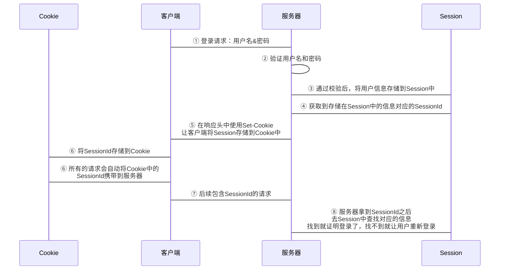

## HTTP 协议无状态的说明（马什么梅？什么冬梅？）

HTTP 协议属于无状态协议，在客户端使用 HTTP 协议与服务端通信的时候，服务器就像是马冬梅家楼下的老大爷一样，比较健忘。每次请求对于服务器来说都是一次全新的请求，对之前的请求毫无记忆。

如果不对此提供相应的解决方案，那么用户在访问网站的时候，页面每跳转一次就得输入一次用户名和密码来给服务器大爷表明身份，可以说用户体验极差。

那么实际开发中我们是如何解决上述问题的？

## HTTP 协议会话状态保持

会话状态保持，指的就是让服务器对之前的请求有记忆，客户端在对服务器发起请求时便不需要每次都进行身份认证，一次登录身份信息一直有效，直至登出或者会话过期。

要实现这样的功能，最简单的方式就是服务器在对客户端进行身份认证之后，给客户端发放令牌，客户端在后续所有的请求中都携带该令牌，这样即可避免重复的身份校验，这里的令牌就像是古代出入皇宫用的令牌，是身份的标识。

### Cookie & Session

本节中不对 Cookie 和 Session 做详细讲解，只涉及会话保持相关内容。

我们可以简单的将 Session 理解为服务器端一小块存储空间，Cookie 为浏览器端的一小块存储空间。

用户正常的登录操作将会如下图所示：


<div style='display: none'>

</div>

### 传统 Token

其实早期 Token 的出现是为了解决单点登录中的 Session 问题以及移动端不能使用 Cookie 的问题的，他和上面提到的 SessionId 功效几乎完全一致。所以你可以把上图中的 SessionID 和 Token 划等号。

这里的 Token 一般都是在用户身份验证成功之后，生成的全局唯一的随机字符串(UUID)，用它作为键将必要信息以及 Token 有效期等信息存储到相关的数据库中，随后将其返回给客户端，客户端需要自行管理接收到的Token, 在后续的请求中，都需要携带这个 Token。在服务器接收到这个 Token 之后，查库验证 Token 的有效性。

和上面 Cookie & Session 差别在于，在使用 Token 的时候，服务端信息存储的位置不局限于 Session 空间，而可以使用 Redis/MongoDB 等NoSQL数据库做分布式存储，这使得鉴权性能以及稳定性都有提升。

注意，这里的 Token 只是一个单纯的通行证，此方式仍然需要在服务器端进行数据存储，随着用户数量的增长，服务器的开支也会随之增大。那么思考一下，如果 Token 本身就能携带信息，那么服务器端就不用再存储数据，是不是就解决了上述服务器储存开支的问题？
## JWT 

JWT（JSON Web Token) 可以算是一种规范化的 Token 身份认证方式，他规定了 Token 中携带信息的方式。

JWT 同样也是服务端在对用户身份验证之后生成 Token，然后颁发给客户端，和普通 Token 不同的是，JWT 中可以携带该 Token 相关的信息，这样服务器端就不再需要额外的存储空间了，服务端在接受到客户端请求的时候，只需要通过 Token 自身携带的信息进行有效性校验即可。

### JWT 使用

客户端通过身份验证之后从服务器端获取到的 JWT 可能是这样的：

```http
eyJ0eXAiOiJKV1QiLA0KICJhbGciOiJIUzI1NiJ9
.
eyJpc3MiOiJqb2UiLA0KICJleHAiOjEzMDA4MTkzODAsDQogImh0dHA6Ly9leGFtcGxlLmNvbS9pc19yb290Ijp0cnVlfQ
.
dBjftJeZ4CVP-mB92K27uhbUJU1p1r_wW1gFWFOEjXk
```

***注意： 这里的为了方便大家看清格式，我将原本的单行文本进行了换行，实际获取到的 JWT 是没有换行的。***

在获取到 JWT 之后，后续的请求需要将获取到的 Token 以 Authorization 为键添加到请求头中:

```http
Authorization:Bearer 你的token
```

比如 axios 默认请求头设置：
```javascript
axios.defaults.headers['Authorization'] = `Bearer ${token}`
```

### JWT 是如何生成的？

实际开发中已经有很多现成的库可以帮我们处理 JWT 相关的内容，比如生成 JWT 以及验证 JWT。所以这节内容中我们不涉及具体代码，只给大家分享 JWT 的工作原理。

#### JWT 的结构

一个 JWT 中包含有三部分，中间用 `.` 隔开： 
* header：使用 base64 处理过的 Token Meta。（`base64(header)`）
* payload：使用 base64 处理过的实际携带的数据。（`base64(payload)`）
* signature: 使用 HMACSHA256 从 `header` `paylaod` 提取。（`HMACSHA256(header + '.' + paylaod, '秘钥')`）

##### Header

包含在 Header 中的 Token Meta 通常由两部分组成：令牌的类型（即 JWT），以及所使用的签名算法，如 `HMAC SHA256` 或 `RSA`。
```json
{
  "alg": "HS256",
  "typ": "JWT"
}
```
##### Payload

Token 的第二部分是荷载（Payload)，荷载中包含声明（claims)。

声明其实就是要在 Token 中存储的信息，比如你的 User 对象，也可以有其他一些额外的信息（这个就是 JWT 特点体现，可以自身携带信息，不再需要服务端存储）。

声明有三种类型（关于这个类型不必过多关注，对使用没有太大影响，了解即可）：

* 预设（registered）：预设就是提前定义好的声明，JWT 不强制要求添加这些声明，但是建议添加，因为可以提供一组可操作性比较强的有用信息。
```
# 大家注意这里的声明键名都是三个字母的，因为用于网络通讯， 所以 JWT 要求紧凑
iss (issuer)
exp (expiration time)
sub (subject)
aud (audience)
```
* 公开（public）：这个就随用户自己随便定义了，当然为了避免命名冲突，一般建议使用[IANA JSON Web Token Registry](https://www.iana.org/assignments/jwt/jwt.xhtml)里面的名字，或者用 URI 做为命名空间, 比如`xxxx.com_username`
* 以及私有（private）：这个其实主要是用来传输数据用的。

一段有效的荷载如下：
```json
{
  "sub": "1234567890",
  "name": "John Doe",
  "admin": true
}
```
***<font color="red">需要大家注意的是：虽然 JWT 可以有效的防止数据被篡改，但是 Token 对于任何人来说其实还是可读的（其实相当于明文传输），所以不要将敏感信息放在 JWT 中</font>***


##### Signature

Token 中最后一部分就是签名，签名使得服务端可以对 Token 做有效性校验（是否服务端颁发以及是否有被篡改）。

签名的算法就使用 Token Meta 中声明的算法，假设我们要使用 `HMAC SHA256` 进行签名，那么操作如下：
```javascript
HMACSHA256(
  base64UrlEncode(header) + "." +
  base64UrlEncode(payload),
  secret)
```

在获取到签名字符串之后，我们将其和之前的两部分放在一起，组成最终的 JWT。


### JWT 请求流程


### JWT 优势

JWT 在现代应用开发中很受欢迎，原因有如下几点：
1. 开销小，占用资源少（因为 JWT 自身携带信息，不需要在服务端进行存储，这样减少存储开支的同时也能省略查库操作提升效率）
2. 能够很方便的进行跨域使用（比如第三方授权，或者集群中 SSO）
3. 可以使用 JWT 实现安全的数据传输（这个特性很少用，目前关注点更多的放在令牌的签名校验上）


### 使用 JWT 要注意的问题

#### Token 注销的问题

服务端不会存储 Token 相关信息，所以 Token 是否有效是由其自身决定的，这样的话服务端是无法主动让 Token 失效的。

那么问题来了，用户如何注销 Token？

最简单直接的办法就是删掉客户端存储的 Token 即可，客户端没了 Token，那么自然就没了访问权限。等等，这不就意味着我们只是删掉了那个 Token, 但是实际上 Token 还是有效的不是么？

怎么确保这个 Token 的确是失效的呢？

目前常见的方案是“黑名单策略”，即在服务器端维护一张表来存储还在有效期内但又需要让其失效的 Token，表内存储用户 `UUID` 以及注销操作的时间 `SignOutTime`，在下次请求来的时候，使用用户 `UUID` 在黑名单表内进行查询，如果找到了相应记录，且当前 Token 的签发时间在 `SignOutTime` 之前，则判定当前 Token 无效。

#### Token 自动续签问题

我们都知道 Session 采用的是滑动时间制，即当用户在指定时间内再次请求服务器，则 Session 有效时长从当前时间自动顺延规定时长，这样就能达到续签的效果。

那么不存在这种机制的 JWT 如何做续签？

在实际应用场景中，比如微信公众号，他的 Token 有效时长为 3600s, 到期之后不会自动续签，客户端需要自行重新请求服务器签发新 Token。

JWT 中会存储用户信息，所以处于安全考虑，有效期一般都会设置比较短，但是针对 C 端的应用来讲，如上微信公众号的方式就变得不太友好，用户用一会儿就得重新输入用户名密码获取新的 Token。所以出于用户体验考虑，Token 自动续签显得尤为重要。

现在常用的做法为如下：

1. 登录后，向客户端发送2个令牌（`access_token`，`refresh_token`）。
2. `access_token` 有效期设置较短，而 `refresh_token` 有效期设置较长。
3. 客户端（前端）将 `access_token` 存储在 LocalStorage 中，将 `access_token` 存储在 cookie 中。
4. 客户端将使用 `access_token` 来调用正常API。 但是，当 `access_token` 过期时，需要从本地存储中获取 `refresh_token`，然后调用身份验证服务器的 API 来获取新的 `access_token` 。
5. 身份验证服务器需要公开一个 API，该 API 接受 `refresh_token`并检查其有效性并返回新的 `access_token` 。
6. 刷新令牌过期后，注销用户不再返回新的 `access_token`。

***注意这里的 `refresh_token` 只是另一个包含更少声明（Claims）的 JWT***

未经允许不得转载~ thx！