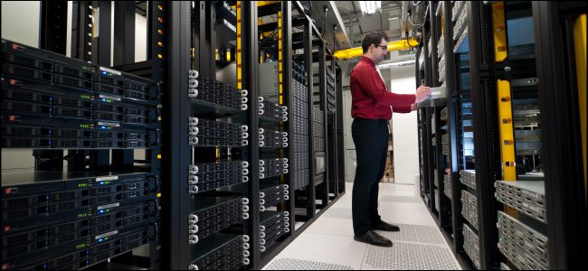

无头服务器（Headless Server），是指没有显示器、键盘、鼠标等其他外设的电脑。无头电脑一般是通过网络进行控制的。举个例子，你可以想象一下数据中心中放在服务器支架上提供 web 服务的刀片服务器，它们就是所谓的无头服务器。

## "Headless" 究竟是什么意思？

”无头“系统指的其实就是没有本地接口的计算机系统，在这台计算机上，没有显示器（就是他的头）等其他外设来供你操作这台计算机。

这样的计算机不是提供给你坐下来像使用你的笔记本或者你的家用电脑一样去使用的，它们通常都没有显卡接口。你想操作它一般都是通过互联网进行远程操作，比如你可以通过过基于 web 的图形化控制面板或者 SSH 这样的提供命令行操作的工具进行操作，当然你也可以通过 Remote Desktop 或者 VNC 这样的图形化操作工具进行远程控制。

你可能会在很多不同的地方看到无头（Headless）这个词汇，但是他们一般都表示同一个意思。无头 Linux 指的就是没有显示器和键盘的 Linux 系统， 无头浏览器指的就是没有图形化界面的浏览器。

## 所以 Headless Server 存在到底有啥意义？

并非每个计算机系统都需要监视器，键盘和鼠标。 许多计算机都是为远程访问而设计的服务器。数据中心到处都是“机架式”计算机，将尽可能多的计算能力打包到尽可能小的空间中。 通过不将每台服务器计算机连接到单独的显示器，它们将节省空间，电力和金钱。

无头系统不仅适用于数据中心。例如，您可能选择将媒体服务器托管在你的旧计算机上，从而使您可以从局域网内的任何设备流式传输媒体。 在配置好之后，您可能会决定移除掉你媒体服务器计算机的监视器，键盘和鼠标，毕竟，您可以通过网络对其进行访问。 您可以将服务器PC放在壁橱中的某个位置并对其进行控制，而不必坐在前面，这样你就拥有了一台无头服务器。

这些系统可以远程控制和管理，而不会影响外围设备。 如果出于某种原因需要带无头服务器的显示器和键盘（可能是为了解决问题），则始终可以在需要时连接这些外围设备。

例如，Gartner估计，截至2016年7月，Google在其全球数据中心中约有250万台服务器。这些服务器将大都是无头服务器-Google也不需要250万台显示器和键盘。
