> 原文链接 [http://www.pgpi.org/doc/pgpintro](http://www.pgpi.org/doc/pgpintro)
> 
> 但是原文网址已经无法访问了，可以通过[https://web.archive.org](https://web.archive.org/web/20161119061018/http://www.pgpi.org/doc/pgpintro)进行访问

## 密码学基础

当凯撒大帝要给自己的将军们传递信息的时候， 他并不相信自己的信使。所以他就把信中所有的字母都向后移动 3 位， A 替换成了 D，B 替换成了 E， 以此类推。 只有知道字母需要“偏移 3 位”这个规则的人，才能解密他的信息。

接下来我们开始。

## 加密和解密

无需经过任何特殊手段就能被读懂的数据被成为纯文本或者明文。隐藏明文真实内容的方法被称为 Encryption（加密）， 加密后产生的无法阅读的数据被称为 ciphertext（密文）。一般我们通过加密的方式来确保我们的信息不被不相干的人获取，哪怕是他们能够看到我们加密后的数据。 将密文转换成其对应的原本的明文的过程，我们称之为 decryption（解密）。图 1-1 展示了这个过程。
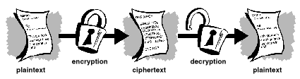

## 什么是密码学（cryptography）？

***Cryptography*** （密码学，这里更偏指的是加密方向的密码学，也可叫密码加密学）是一门利用数学对数据进行加密和解密的科学。密码学让我们能够存储一些敏感信息或者在不安全的网络环境（比如互联网）下进行信息传递。这样除了目标接收方之外，其他任何人都无法获取这些信息。

***Cryptography*** （密码学，这里更偏指的是加密方向的密码学）是用来加密数据的科学，而 ***Cryptanalysis*** （密码学， 这里更偏指的是分析和破解方向的密码学，也可以叫密码分析学）是一门分析和破解安全通信的科学。经典密码分析是涉及分析推理、数学工具的使用、模式的发现、耐心、决心和运气的有趣组合。密码分析员也被成为攻击者。

***Cryptology*** (密码学，总称) 包括 ***Cryptography*** (密码加密学) 和 ***Cryptanalysis***（密码分析学）。

### 强加密

> 世界上有两种密码学：一种可以防止你的姐姐阅读你的文件，另外一种密码学则可以防止政府阅读你的文件。这本书是关于后者的。
>
> ——Bruce Schneier，《应用密码学:协议、算法和C语言的源代码》

PGP 其实也是关于后者的密码学。 就像上面讲的那样，密码加密学可以是强加密也可以是弱加密，密码的强弱程度事宜将其恢复成明文所需要的时间和资源来衡量的。强密码学可以保证在没有适当的解码工具的情况下，密文很难被破解。那到底有多难？以今天地区上所有的计算力和可用时间，即使是是一台计算机同事工作，每秒进行十亿次运算，也不可能在宇宙毁灭前破译出明文。

有人可能会想，这样的话，即使是面对特别厉害的密码分析员或密码分析技术，这种强大的加密技术仍然可以好的应对。但是谁会这么说呢？没人能证明一个在今天及其强大的加密技术，在明天的算力之下还能这么强大。不管怎么说，PGP 采用的是迄今为止最可靠的加密方式。而且，警惕和保守会比声称坚不可破更能保护你。

### 加密的原理是什么样的

加密算法是一种在加密和解密过程中使用的数学方法。加密算法结合一个密钥（一个单词、一个数字、一个词组）来加密明文。同样的明文使用不同的密钥加密出来的密文也是不一样的。加密数据的安全性取决于两个因素：加密算法的强度以及密钥的安全性。

一个加密算法，加上所有可能的密钥以及所有令其正常工作的协议组成了一个加密系统。PGP 就是一个加密系统。

## 常规加密学

常规加密学，也被称为密钥加密或者对称密钥加密，加密和解密使用的是同一个密钥。DES（数据加密标准）就是一个被联邦政府广泛使用的常规加密系统。图 1-2 展示了常规加密的过程。
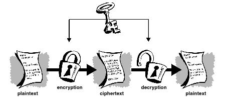

### 凯撒密码

常规加密非常简单的一个例子就是替换密码。替换密码将信息替换成另外一个信息。这个通常是将字母表中的字母进行偏移来实现的。典型的两个例子就是你可能从小就拥有的 [午夜船长的秘密解码指环](https://en.wikipedia.org/wiki/Secret_decoder_ring) 和 [凯撒密码](https://baike.baidu.com/item/%E6%81%BA%E6%92%92%E5%AF%86%E7%A0%81/4905284)。在这两个例子中，加密算法都是将字母表中的字母进行偏移，而偏移的位数就是对应的密钥。

举个例子，假设我们使用凯撒密码来加密 `SECRET` 这个单词，并且设置密钥为 3， 那我们把字母表进行偏移，使其从第三个字母 `D` 开始。

原本的字母表应该是 `ABCDEFGHIJKLMNOPQRSTUVWXYZ`, 把所有的字母都向前移动 3 位之后， 你会得到 `DEFGHIJKLMNOPQRSTUVWXYZABC` 这样一张字母表。那么你的 `D` 就对应原来的 `A`， `E` 对应原来的 `B`， `F` 对应原来的 `C`， 以此类推。

使用这种方式，原来的明文 `SECRET` 就会被加密成 `VHFUHW`。当你想要某个人能够读懂这段加密文本的时候，只要告诉他你的密钥 `3` 就好了。

很明显，按照今天的标准来讲，这种加密方式弱爆了。但是，大兄弟，这东西对凯撒可太有用了，而且这种方式很清晰的说明了常规加密的原理。

### 密钥管理和传统加密

常规加密有很一些好处，它很快，对于加密那些不需要传输到别的地方去的数据来讲非常有用。但是因为密钥的奋发非常困难，如果使用传统加密方式作为数据安全传输的手段，就会导致成本非常高。

回想一个你最喜欢的谍战片中的一个角色，有这么一个场景：一个人用手铐在手腕上拷这一个公文包。这个公文包里会是什么呢？总之，它不会是导弹发射密码，也不会是生化武器的分子式，也不会是一份入侵计划。而是一个用来解密信息的密钥。

使用传统加密方式进行安全通信的双方，必须在密钥上达成一致，并且需要保证密钥的安全。如果他们处在不同的地理位置，那么他们就必须找到一个能够信任的信使、或是加密电话、或是其他的安全通信媒介来保证密钥在传输过程中不会泄露。任何在传输过程中窃听或者拦截到密钥的人，都可以读取、修改、伪造所有用这个密钥加密或者认证的加密数据。

从 DES 到 午夜船长的解码指环， 传统加密方式一直存在的问题就是：如何在不被拦截的情况下将密钥传输给接收者。

## 公钥加密

公钥加密解决了传统加密存在的问题，公钥加密的概念是由 Whitfield Diffie 和 Martin Hellman 在 1975 年的时候提出来的。（有证据表明，英国特勤局早于 Whitfield Diffie 和 Martin 几年前发明了公钥加密，但是一直把它作为军事机密，也没有产出什么实际价值。[JH Ellis：安全非秘密数字加密的可能性，CESG报告， 1970年1月]）

公钥加密是一种使用一对密钥进行加密的非对称性加密方案：一个用于加密数据的公钥，和一个用于解密数据的私钥（或者叫秘密密钥）。在向全世界公开你的公钥的同时，秘密保存自己的私钥。任何拥有你公钥的人，都可以加密出只有你能够阅读的数据，哪怕这个人见都没见过。

用公钥来推导出私钥在计算上是不可行的。任何拥有公钥的人都能够对数据加密，但却不能解密，只有拥有与之匹配的私钥的人才能解密信息。

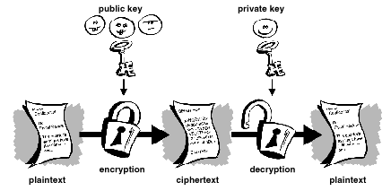

公钥加密最大的好处在于，他允许之前未进行任何安全约定的人安全的交换信息。 之前需要通过安全的方式进行密钥传递的需求不复存在了， 所有的通信只涉及公钥，私钥再也不需要被传递或者分享。 Elgamal（以发明者名字命名：Taher Elgamal）， RSA（以发明者名字命名：Ron Rivest、 Adi Shamir、Leonard Adleman）， Diffie-Hellman（还是以发明者名字命名），还有电子签名算法 DSA（David Kravitz 发明），这些都是公钥加密系统的具体例子。

由于传统加密方式曾是唯一可用的信息安全传输的手段，但是昂贵的安全通道以及密钥分发费用导致只有那些能负担的起的人在用，比如政府和大型银行（或者带着解密指环的小朋友 😂）。 公钥加密是一场将强加密方式带给普罗大众的技术革命。还记得那个手腕上拷着公文箱的间谍吗？ 公钥加密让他失业了（或者这倒也让他解脱了）。

## PGP 工作原理

PGP 结合了传统加密和公钥加密的一些最好的功能， 它算是一个混合型加密系统。 当用户使用 PGP 加密明文的时候， PGP 首先对明文进行压缩。 数据压缩可以节约现代数据传输时间和数据存储空间，更重要的是，它可以加强加密强度。 大多数密码分析技术都是利用明文中发现的模式来破解密码的，压缩减少了明文中的模式，从而显著提升了密码分析的障碍。（太小的文件或者无法被压缩的文件就不压缩了）

然后 PGP 会创建一个一次性的会话密钥， 这个密钥是根据你的鼠标的随机移动和键盘按键产生的一个随机数字（所以在生成 PGP key 的时候会要求你动动鼠标动动键盘）。 然后 PGP 会用这个密钥结合一种非常安全且快速的传统加密算法对明文进行加密，加密的结果就是密文了。一旦数据被加密好了，然后这个会话密钥就会用接收方的公钥进行加密，这个公钥加密后的会话密钥就会随着密文一起发送给接收方。

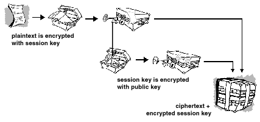

两种加密方式的结合，集公钥加密的便捷和传统加密方式的速度于一身。 传统加密方式要比公钥加密快大约 1000 倍左右，而公钥加密反过来又为密钥的的分发和数据传输问题提供了解决方案。两者一起使用，在不牺牲任何安全性的同时，既提高了性能，又改善了密钥分发存在的问题。

## 密钥

密钥是与加密算法配合使用产生特定秘文的一个值。 而密钥基本上都是非常非常大的数字， 密钥的大小是用 `bit` （位）来衡量的，代表1024位密钥的数字超级无敌大。 在公钥加密中， 密钥越大， 密文也就越安全。

然而， 公钥的大小和传统加密方式中的密钥大小是没啥关联的。传统加密方式中的 80 位密钥的强度和 1024 位的公钥没啥差别。 一个 128 位的传统密钥相当于 3000 位的公钥。 同样的， 密钥越大， 安全性就越高， 但是每种加密方式所使用的算法都不尽相同，就想苹果和橘子一样。

尽管公钥和私钥在数学层面是相互关联的，但是仅凭公钥就想推导出私钥是非常困难的，不过如果能够提供充足的时间和算力，推到出私钥也不是不可能。 这就意味着，选择正确的密钥大小非常重要， 足够大的密钥能够保证安全，但是足够小的密钥又能兼顾速度。 此外， 你还需要考虑，谁会尝试去破解你的文件，他们的决心有多大， 他们又有多少时间，以及他们可能会有什么样的资源等等。

较大的密钥会在比较长的一段时间内是加密安全的。 如果你想加密的东西需要隐藏很多年，那你可能需要使用一个非常大的密钥。 当然， 没人能保证在明天的计算机硬件条件下进行破解，你的密钥能坚持多久。 曾经有一段时间，56位对称密钥被认为是非常安全的。

密钥是以加密形式存储的。 PGP 将密钥用两个文件存储在你的硬盘里，一个是公钥，另外一个是私钥。 这些文件被叫做密钥环。 在使用 PGP 的时候，通常会将接收方的公钥添加到公钥环中，你的私钥会存储到你的私钥环中。 若果你把私钥环弄丢了， 那你就没办法解密在该密钥换上加密的任何消息。

## 数字签名

公钥加密的一个主要的好处在于，它提供了一种使用数字签名的方法。 数字签名使得信息的接收者能够验证信息来源的真实性， 也能够验证信息的完整性。 因此，数字签名提供了身份验证和数据完整性验证。 数字签名还提供了不可抵赖性， 这意味着他可以防止发送方声称他实际并没有发送消息。 这些功能于密码学而言，与隐私保护一样重要，甚至更重要。

电子签名和首先签名的作用是一致的，然而手写签名特别容易伪造，在这一点上数字签名就比手写签名厉害了，因为它几乎不可能伪造。 此外，他还可以证明信息的内容和签名者的身份。

有些人更倾向于使用签名而不是做加密，比如： 你应该不太会关心是否有人会知道你往自己的银行账户里面存如了 1000 元， 但是你肯定要确定的是跟你打交道的那个人是银行出纳。

数字签名的基本方式如图 1-6 所示， 跟数据加密时使用别人的公钥进行加密信息不一样的是，数字签名的时候，你使用的是自己的私钥对数据进行加密。如果别人收到的消息能用你的公钥进行解密，那么这个消息必然是你发出去的。

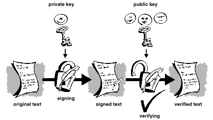

### 哈希函数

上述的签名系统其实存在一些问题， 太慢了， 而且会产生大量的数据（至少会是原有信息的两倍大小）。 而对上述方案进行改进的方式，是在过程中添加一个单向的哈希函数。 一个单向的哈希函数接收可变长度的数据作为输入（比如一条任意长度的消息，甚至超过上千或上百万位），然后会产生一个固定长度的输出，比如 160 位。 哈希函数能够确保的是，如果输入的信息发生变化，哪怕是只变化一位，也会产生一个完全不一样的输出。

PGP 对用户签名的明文使用的是强加密的哈希函数， 这样就会产生一个固定长度的数据，可以理解为数据摘要（再次强调， 任何变化都会导致输出的数据摘要完全不一样）。

然后 PGP 会使用数据摘要和私钥创建最终的“签名”。 在发送数据的时候， PGP 会将签名和明文一起发送，在接收方接收到消息之后， 再次使用 PGP 对明文提取摘要信息，这样就能对签名进行验证。 PGP 可以加密明文也可以不加密， 如果一些接收方对信息不感兴趣或者他们自身无法验证签名，那么对明文签名是很有用的。

一旦使用了安全的哈希函数， 把一个人的签名从一个文档中拿到另一个文档中， 或是修改一个已经签名过的信息，都不再可能了。即使是对已经进行过签名的文档进行再小的修改都会导致数字签名验证失败。

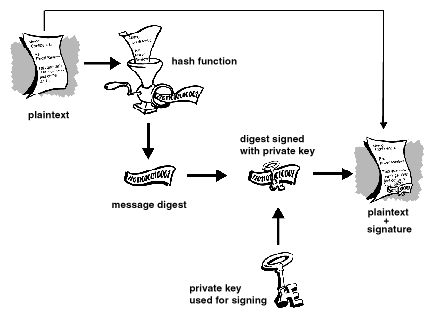

数字签名在鉴权和验证其他 PGP 用户的密钥方面发挥着重要作用。

## 数字证书

公钥加密系统存在的一个问题是， 用户必须时刻保持警惕， 确保使用的是正确的人的密钥进行加密。 在通过公共服务器自由交换密钥这种安全的环境中，中间人攻击是一个潜在的威胁。 在这种攻击中， 有人会发布带有目标收件人用户名称和 ID 的假密钥，原本要正确发送的加密数据现在就会被假密钥的所有者截获。

在一个公钥环境中，确认你加密所用的公钥属于你的目标接收人这件事至关重要， 你可以使用通过物理途径转交给你的密钥进行加密，但是问题在于，假设你需要和那些你从素未谋面的进行通信，你有怎么能够保证你拿到的密钥是正确的呢？

数字证书，或者简称为证书， 简化了确认公钥是否真正属于所谓的所有者这件事情。

证书是凭证的一种形式， 比如你的驾驶证，或者你的社保卡，再或者你的出生证明。 所有的这些，每一个上面都有一些用来识别你身份的信息，或者用来证明其他人已经确认过你的身份。 还有一些证书（如护照或者身份证），他们是非常重要的身份证明， 你不会想丢失他们， 以免有人来冒充你的身份。

数字证书其实是和物理证书功能类似的数据。 数字证书中包含公钥信息，可以帮助其他人来确认这个公钥是真实有效的。 数字证书可以用来阻止心怀不轨的人用其他的公钥来假冒别人的公钥。

一个数字证书由三部分组成：

* 一个公钥
* 一个证书信息（标识用户身份的信息，比如用户名或者用户 ID）
* 一个或多个数字签名

数字证书中的数字签名的目的是为了表明证书信息已经由某个人或者机构进行过证明。 数字签名不能证明整个证书的真实性， 它能保证的只有一件事儿， 那就是证书中的身份信息和公钥是一起的或者说是绑定的。

因此， 证书基本上算是一个公钥， 附带一种或者两种的 ID 信息， 再加上来自其他受信任的个体的印章。

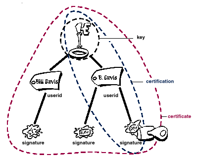

### 证书颁发

证书会被用在和需要其他人进行公钥交换时。 对于希望进行安全通信的小组织来讲， 手动交换包含每个所有者公钥的存储器或者 email， 其实都是很容易的。 这个算是手动的公钥分发，但是具有一定的局限性。 除此之外， 必须提供一个具备安全性，存储和交换机制的系统，以便协同工作者、业务伙伴或者陌生人可以在有需要的时候通信。这个事情，可以通过一种只提供存储形式仓库的服务器进行，这种被称为证书服务器，也可以通过更加结构化的系统来做， 这种具备多密钥管理功能系统被称为公钥基础设 Public Key Infrastructures（PKIs）。

#### 证书服务器

证书服务器，也可以被称作密钥服务器， 是一个允许用户进行证书存储和提取的数据库。 证书服务器一般都会提供一些管理功能， 以便公司能够进行安全策略的维护（比如： 尽存储那些满足要求的密钥）。

#### 公钥基础设施（PKI）

PKI 包含证书服务器的证书存储设备，并且提供证书管理功能（颁发、撤销、存储、检索以及信任证书的能力）。PKI 的主要功能是引入了所谓的证书颁发机构（Certification Authority），或者可以叫 CA，这个机构是一个已经向他们的用户颁发了证书的人类实体、或者叫人类组织（一个人、一个组织、一个部门、一个公司或者一个社团都有可能。 CA 的角色，就像是一个政府的护照办公室）。 CA 会创建证书并使用 CA 的私钥对其进行数字签名。 因为 CA 有着创建证书的角色， 所有它是 PKI 的核心组成部分。

使用 CA 的公钥， 任何想要去验证证书真实性的人都能去验证 CA 的数字签名， 从而验证证书内容的完整性（最重要的是公钥和证书持有者的身份）。

### 证书格式

数字证书基本上算是一组表示信息，他们与公钥绑定在一起，由可信任的第三方签名，用来证明公钥的真实性。
数字证书可以是众多不同格式中的一种。

PGP 可以识别一下两种不同格式的证书：

* PGP 证书
* X.509 证书

#### PGP 证书格式

一个 PGP 证书包含但不限于如下这些信息：

* **PGP 版本号** —— 这个用来标识创建和证书关联的密钥的 PGP 的版本号
* **证书持有者的公钥** —— 密钥对的公钥部分， 还有密钥的算法： RSA、DH、DSA
* **证书持有者的信息** —— 由用户的身份信息组成，比如用户的姓名、 ID、照片等
* **证书所有者的数字签名** —— 这个也称为自签， 使用的是这个证书中包含的公钥所对应的私钥完成的签名
* **证书的有效期** —— 证书的开始和过期日期
* **证书的首选对称性加密算法** —— 表示证书拥有者希望对信息进行加密的加密算法。 支持的算法有 CAST、IDEA 或 Triple-DES。

你可以将 PGP 证书想象成是带有一个或者多个标签的公共密钥（参见图 1-9）。 在这些标签上， 你会发现密钥所有者的信息标识以及密钥所有者的签名， 这个标签能够表明密钥和信息标识是对应的。（这种特殊的签名叫做自签， 每个 PGP 证书中都包含 一个自签）

PGP 证书格式比较特别的一点是单个证书可以包含多个签名。 几个或者很多人会对“密钥-身份”对进行签名，以证明他们可以确保这个公钥绝对数据特定的拥有者。 如果你查看公共证书服务器，你可能会注意到某些证书（比如 PGP 创始人 Phil Zimmermann 的证书）， 里面就包含了很多签名。

一些 PGP 证书由一个公钥和一组标签组成， 每个标签上都使用不同的方式来标识密钥的所有者（例如： 所有者的姓名和企业邮箱账户， 所有者的昵称和家庭邮件账户， 所有者的照片， 都在同一个证书里）。 而每个标签的签名列表又可能不一样， 签名证明的是其中某一个标签是属于公钥这件事儿， 而不是证明这个密钥相关的所有标签的真实性。（请注意： 注意，在观察者严重，“真实”是相对而言的，签名是一种观点，不同的人在签署密钥前会对其真实性进行不同程度的尽职调查）

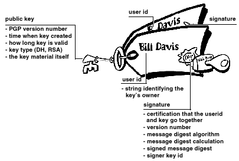

#### X.509 证书格式

X.509 是另外一种非常常见的证书格式。 所有 X.509 证书均符合 ITU-T X.509 国际标准，因此，从理论上来讲， 为一个应用程序创建的 X.509证书可以被所有符合 X.509 标准的程序使用。 然而，在实践中，各家公司已经为 X.509 证书做了自己相应的扩展，并不是所有的扩展都能一起使用的。

证书要求有人进行对公钥和密钥的所有者的对应关心进行验证， 使用 PGP 证书， 所有人都可以承担验证者的角色。 而对于 X.509 证书， 验证人员始终是证书颁发季候或者 CA 指定的人员。 （请记住，PGP 证书完全支持使用 CA 验证证书的层次结构）。

X.509 证书是一组标准字段的集合， 这些字段包含关于用户或设备的信息及其对应的公钥。 X.509 标准定义了证书包含的信息，并描述了如何对其进行编码(数据格式)。 所有X.509证书都有以下数据：

* **X.509 版本号** —— 标识该证书适用的 X.509 标准版本，这会影响包含在证书中的信息。 最新版本是 3
* **证书持有者的公钥** —— 证书持有者的公钥，还有标识该密钥属于哪个密码系统的哪个算法的信息，还有一些相关的密钥参数。
* **证书编号** —— 创建证书的实体(应用程序或个人)负责为证书分配的惟一序列号，以区别于同机构颁发的其他证书。这些信息被用在许多方面， 例如， 当一个证书被撤销时，它的序列号会被放进证书撤销列表（Certificate Revocation List - CRL）中。
* **证书持有者的唯一标识** —— （或者叫Distinguished Name)。 这个名称是为了在互联网上进行区分的唯一标识。 一个 DN 会有多个子节点， 看起来会是这样：

    ```text
    CN=Bob Allen, OU=Total Network Security Division, O=Network Associates, Inc., C=US
    ```

    通用名称（Common Name - CN）、组织单位（Organizational Unit - OU）、组织（Organization - O）和国家（Country - C）。

* **证书有效期** —— 证书的开始和过期日期
* **证书发行者的数字签名** —— 使用颁发证书的人的私钥进行的签名。
* **签名算法标识** —— 标识 CA 签名该证书时使用的签名算法

X.509 证书和 PGP 证书之间与很多不同， 但是最显著的区别如下：

* PGP 证书你可以自己创建，但是 X.509 证书你必须向 CA 申请后颁发给你。
* X.509 证书本身只支持单个名字
* X.509 证书只支持单个数字签名来证明密钥的有效性

要获得 X.509 证书，必须向 CA 请求颁发证书， 你提供你的公钥， 并且证实你拥有与之匹配的私钥，还需要提供一些关于你自己的的特定信息， 然后再对这些信息进行整体数字签名， 并且将信息打包发送给 CA。 CA 随后会进行一些调查，验证你提供的信息的准确性， 如果准确， 就会生成证书， 然后返回给你。

有没有感觉 X.509 证书就像一个标准的纸质证书一样 (类似于你在上完大学之后拿到的学位证)，证书上贴着一个公钥。上面有你的名字和一些关于你的信息，还有证书颁发者的签名。

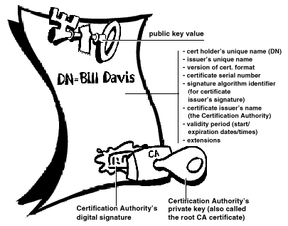

当今 X.509 证书使用最广泛的用途是在Web浏览器中。

## 有效性和信任

在公钥系统中，每个用户都很容易受到假密钥的困扰。 有效性是指对公钥证书属于声称其所有者这件事儿的信心。 在公钥环境中， 有效性及其重要， 在这种环境中， 你必须不断的确认某个证书的真实性。

当你自己确信某个证书确实属于某个人时， 你可以在你的密钥环上对其副本进行签名， 以证明你已经检查过了这个证书， 并且已经证实这个证书的真实性。 如果你想让其他人知道你已经给这个证书盖上了自己的认证印章， 那么你就可以把签名导出到证书服务器上， 这样别人也就能看到了。

在 [PKI](#公钥基础设施（PKI）) 一节中， 我们已经说过， 一些公司会指定一个或多个证书颁发机构（CAs）来表示证书的有效性。 在使用 X.509 证书的 PKI 的组织中， 向用户颁发证书是 CA 的工作（通常需要响应用户对证书的请求）。 在使用 PGP 证书而没有 PKI 的组织中， CA 的工作是检查所有 PGP 证书的真实性， 然后对已经认证过的证书进行签名。 总的来讲， CA 的主要目的就是将公钥和证书中包含的标识信息进行绑定， 从而向第三方保证证书的有效性（已经采取了一些谨慎的措施，来确保这件事情）。

CA 是组织中验证工作的权威， 或者可以说大家都信任的人， 在一些组织中， 比如使用 PKI 的组织， 如果证书没有被受信任的 CA 进行签署， 那么这个证书就不会被视为有效。

### 有效性检查

建立有效性的手段之一是通过一些手动的处理。 有好几种方法可以完成这个操作， 你可以要求指定的接收者亲自将其公钥的副本交给你（通过物理途径）， 但是这样显然很不便，效率非常低。

另外一种方式就是手动检查证书的指纹， 就像每个人的指纹都是唯一的一样， 每个 PGP 证书的指纹也是唯一的。 指纹是用户证书的哈希值， 作为证书的属性之一。 在 PGP 中， 指纹会显示为十六进制的数字或者以一系列所谓的生物特征词的形式出现， 他们在语音学上是不同的， 用于指纹识别过程会更容易一些。

你可以通过打电话给证书的所有者（以便交流），要求他给你提供他密钥的指纹， 然后进行指纹对比，来验证证书的有效性。 这种方法只在你认识证书所有者的时候有效， 但是如果所有者你不认识怎么办？ 有些人把指纹印在名片上就是为了这个。

另外一种给证书提供有效性的方式是相信第三方已经完成了证书的验证。

例如： CA 负责确保在证书颁发之前， 他会自习检查证书， 确保公钥确实属于证书的所有者， 信任 CA 的任何人都会默认的认为有 CA 签名的任何证书都是有效的。

检查有效性的另一个方面是确保证书没有被撤销。有关更多信息，请参见[证书撤销](#证书撤销)一节。

### 建立信任

你验证证书， 你信任别人。 更具体的说， 你信任他人来验证别人的证书。 通常情况下， 除非证书所有者亲手把证书交给你， 否则你就必须通过别人的话来判断证书的有效性。

#### 元介绍者和受信赖的介绍者

在大多数情况下， 人们完全信任 CA 来确认证书的有效性。 这意味着其他所有人都依赖于 CA 来完成整个手动验证的过程。 对于一定数量的用户或者工作地点来说， 这都是可以接受的。 但是在一定的量级之后， 维持相同的验证品质对于 CA 来讲就不太可能了。 所以在这种情况下， 必须想系统添加其他验证者。

CA 也可以是一个元介绍者。 一个元介绍者不仅能赋予密钥有效性， 他还能赋予其他人信任密钥的能力。 就像一个皇帝可以把玉玺交给他信任的顾问，让他们按照他的权威行事一样。 元介绍者也能让其他人成为可信赖的介绍人， 这些受信任的介绍者可以进行密钥验证， 可以达到和元介绍者相同的效果。 但是， 他们无法创造新的可信赖的介绍者， 只有元介绍者可以这么干。


元介绍者（Meta-Introducer）和受信赖（Trusted Introducer）的介绍者都是 PGP 的术语。 在 X.509 证书环境中， 元介绍者被称为根证书颁发机构（Root CA）， 而受信赖的介绍者被称为证书颁发机构的下属。

根 CA 使用与被称为根 CA 证书的特殊证书类型相关联的私钥怼证书进行签名。 由根 CA 证书签署的任何证书都被根证书签署的其他证视为有效。 这个验证过程甚至适用于系统中其他 CA 签署的证书， 只要根 CA 证书签署了下级 CA 的证书， 则由 CA 签署的任何证书都被视为对整个体系中的所有其他证书有效。 通过对系统进行检查以查看谁签署了谁的证书的过程称为跟踪证书，或者证书链。

### 信任模型

在相对封闭的系统中， 比如一个小公司中， 追踪证书到根 CA 很容易。 但是， 用户必须经常与公司环境之外的人进行沟通， 其中就包含他们从未见过的人， 比如供应商啊、客户、客户的同事等等。 对那些未被你的 CA 进行验证的或者说信任的人， 简历信任关系是非常困难的。


公司遵循这样或那样的信任模型， 信任模型规定了用户将如何简历证书的有效性，有三种不同的模型：

* 直接信任
* 分级信任
* 信任网

#### 直接信任

直接信任是最简单的信任模型。 在这种模型中， 用户相信密钥是有效的，因为他知道密钥的来源。 所有的加密系统都以某种方式使用这种形式的信任。 比如， 在浏览器中， 根 CA 的密钥是直接被信任的， 因为它们是由制造商提供的。 如果存在任何形式的层次结构， 那都是从这些直接信任的证书扩展而来的。

在 PGP 中，自己验证密钥并且从不把另外一个证书设置为受信任的介绍者的用户使用的就是直接信任。

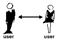

#### 分级信任

在一个分级系统中， 存在许多“根”证书， 信任可以从这些证书中进行扩展。 这些证书可以自己对自己进行认证，也可以对在他们的链路上的认证其他证书的证书进行认证。 我们可以把它认为是一棵巨大的“信任”树， “叶子”证书的有效性是通过向上追踪来是实现的，一直向上找，直到找到一个受信任的根证书为止。

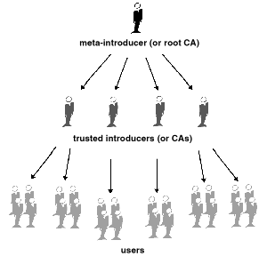

#### 信任网

信任网包含了其他两种模型， 但也增加了信任是在旁观者眼中的这个概念（这是现实世界的观点），和信息越多越好的概念。 因此，它是一个累积信任的模型， 一个证书可以直接受信任，或者在某个链中受信任，该链最顶层是一个直接受信任的根证书(元介绍者)，或者由某个介绍者组受信任。

也许您听说过“六度分离”（six degrees of separation）这个术语，它表明世界上任何人都可以使用六个或更少的其他人作为中介来确定与世界上任何其他人的某种联系。 这是一张介绍者的网。

这同样也是 PGP 对信任的看法。PGP 使用数字签名作为它的介绍形式。当任何用户签署另一个密钥时，他或她就成为该密钥的介绍人。随着这个过程的进行，它建立了一个信任的网络。（也就是说，只有当你认为我是一个值得信任的介绍人，你才会相信我关于别人钥匙真实性的看法。 否则，我对其他钥匙有效性的看法就没有意义了。）

存储在每个用户的公钥环上的是如下信心的指示器：

* 用户是否认为特定的密钥有效
* 用户对密钥的信任程度，密钥的所有者可以作为其他人密钥的证明者

你在你手中我的钥匙副本上，指出你是否认为我的判断很重要。 这是一个真正的声誉系统: 某些人被认为能给出好的签名，人们相信他们能证明其他密钥的有效性。

#### PGP 信任等级

对密钥的最高信任级别（隐式信任）是对自己的密钥对的信任。 PGP 假定，如果你拥有私钥，则必须信任其相关公钥的操作。 由你隐式信任的密钥签名的任何密钥均有效。

你可以为其他人的公钥分配三种信任级别：

  * 完全信任
  * 边缘信任
  * 不信任

让人困惑的是， 有效性，其实也有三个级别：

  * 有效
  * 边缘有效
  * 无效

将他人的密钥定义为受信赖的介绍者，你

  1. 从一个有效的密钥开始， 该密钥可以是
     * 由你签名的 或者是
     * 由其他受信赖的介绍者签名的
      然后
  2. 为密钥所有者设置你认定的有资格获的信任等级

例如， 假设你的密钥环上包含了 Alice 的密钥。 你已经验证了 Alice 的密钥，而且通过签名的方式进行了标记。 你知道 Alice 的品质满足完全满足验证其他人密钥的要求， 因此， 你将她的密钥标记为完全信任。 这就让 Alice 变成了一个 CA。 如果 Alice 在其他人的密钥上进行签名， 那这个人在你的密钥环上也会显示为有效。

PGP 需要一个完全受信任的签名或者两个边缘信任的签名才能认定密钥的有效性。 PGP 认为两个边缘信任等同于一个完全信任就像商人要求两种形式的ID。 你可能会认为 Alice 值得信赖，同时也认为 Bob 值得信赖。 其中任何单独一个人都有意外签署伪造密钥的风险，因此您可能不会完全信任其中任何一个， 但是，两个人一起签署相同假密钥的可能性很小。

## 证书撤销

证书只有在有效时才有用。 简单的假设一个证书永久有小是不安全的。 在大多数组织和所有的 PKI 中， 证书的有效期是有限制的。 这就限制了发生证书泄露时系统的脆弱期。

因此， 证书都是以有计划的有效期进行创建的： 有`开始日期/时间`和`结束日期/时间`。 证书在这个时间段内都可以使用。 证书过期后，就不再有效了， 因为无法确保密钥和标识信息对的真实性。 （这个证书仍然可以安全的用于重新确认在有效期内进行加密或者签名的信息， 但是新的加密任务或者签名任务就不应该信任这个证书了）

在一些情况下， 需要在证书到期前让其失效， 比如当证书持有者终止了与公司的雇佣关系或者怀疑证书对应的私钥已经泄露的时候。 这被成为证书撤销， 被撤销的证书比过期证书更可疑， 过期的证书虽然不可用， 但是不会带来和撤销证书同样的威胁。

任何签署了证书的人都可以撤销其在证书上的签名（前提是他要使用和当时签名相同的私钥）。 撤销签名表示签名者已经不再信任公钥和表示信息的对应关系， 或者证书的公钥已经被破坏了。 撤销签名和撤销证书的严重性是相同的。

在 X.509 证书中， 撤销签名实际上和撤销证书是一样的， 因为证书上唯一的签名就是时期生效的 CA 的签名。 PGP 证书提供了附加功能， 如果你觉得证书已经被破坏了， 那你可以撤销你的整个证书（ 而不仅仅是撤销上面的签名）

只有证书的所有者（对应私钥的持有者）或者被证书所有者指定为撤销者的人可以撤销 PGP 证书。 （指定撤销者是一种有用的做法， 因为丢失证书对应的私钥的密码会导致证书所有者撤销自己的证书， 但是这个只有在他能访问自己的私钥的时候能这么做） 只有证书的颁发者才能撤销 X.509 证书。

### 通知证书已经被撤销

当证书被撤销后， 一定要让证书的潜在用户知道这个证书不在有效。 对于 PGP 证书，传达证书一杯撤销最常见的方法就是将其发布到证书服务器上，以便警告其他希望于你通信的人不要使用这个证书。

在 PKI 环境中， 最常见的方式是通过 CA 发布的被称为撤销列表（CRL）的东西来实现撤销通告。 CRL 包含系统中所有未过期但是已被撤销的证书的列表。 被撤销的证书只在其过期之前保留在这个列表中， 等到过期之后会将其删除，这样可以防止列表过长。

CA 会按照一定的计划周期向用户分发 CRL，从理论上讲， 这可以防止用户在不知情的情况下使用受损的证书。 但是， 用户可能会在两次 CRL 分发时间之间有的一段时间内使用受损的证书。

## Passphrase 是什么？

大部分人都熟悉通过密码来限制对计算机系统的访问， 密码是用户键入的作为标识码的唯一字符串。

Passphrase 是加长版本的 Password， 而且理论上，Passphrase 会更安全一些。 Passphrase 通常是有多个单词组成的， 因此可以更有效的抵挡标准的字典爆破攻击。 最佳的 Passphrase 相对较长而且比较复杂， 一般是包含大小写字母、数字和标点符号的组合。

PGP 使用的就是 passphrase 对你机器上的密钥进行加密的。 你的密钥会使用你的 passphrase 的哈希值进行加密。 然后你可以使用你的 passphrase 对私钥进行解密， passphrase 对你来讲应该设置那种很难忘记的，而且要很难被别人猜到。 应该找那种已经根植于你记忆当中的内容， 而不是那种你现想的然后尝试将其记住。 因为 ***如果你忘记了你的 passphrase， 那就太不走运了***， 没了 passphrase， 你的密钥就废了， 啥事儿也干不了了。 还记得本文前面的介绍吗？ PGP 是用来防止政府查看你文件的加密技术， 当然它也会让你自己看不了你的文件， 当你决定把自己的密码改成一个笑话的时候，你得注意，你很可能会永远忘记它。

## 密钥分持

俗话说的好， 如果一个秘密被一个以上的人知道了，那它就再也不是秘密了。 将私钥进行共享也是如此， 尽管不建议这么做， 但是有时候又不得不进行私钥对共享。 比如， 公司的签名密钥是公司用来签署法律文件、敏感的人员信息或者验证新闻稿的真实性。 在这种情况下， 公司就会有很多人可以使用公司的私钥， 但是这也意味着另一件事儿， 就是任何个人都能完全代表公司行事。

在上面这种情况下， 明智的做法就是讲密钥分配给多个人， 这样一来， 超过一两个以上的人必须出示一部分密钥才能使密钥处于可用状态， 如果出示的可用密钥太少， 那么密钥整体就不可用了。

一些人则是将密钥拆分成三部分， 并且要求其中两个来构成密钥， 或者分成两部分， 而且同时需要两个来组成密钥。 如果在充足的过程中使用的是安全的网络连接， 则出示密钥的人就不需要亲自到场来组合密钥了。