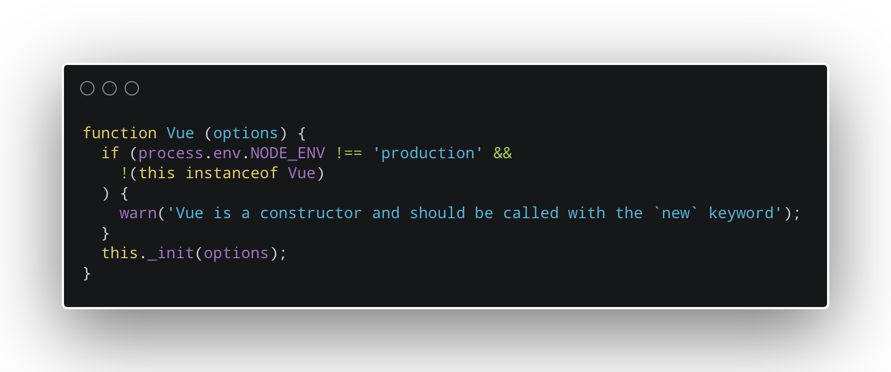

本系列文章详细介绍了Vue.js源代码，对其中的JavaScript代码进行了详细的说明。 并且尝试将概念分解为JavaScript初学者可以理解的水平。

## Vue 构造函数

 Vue 实例是深入了解 Vue.js 源代码的最合适的切入点。 正如 Vue.js 指南所解释的那样，“每个 Vue 应用程序都是通过使用 Vue 构造函数创建一个新的 Vue 实例来开始的。”


在 Vue.js 源代码中，创建新的 Vue 实例是通过使用 Vue 对象构造函数来实现的：

```javascript
function Vue (options) {
  if (process.env.NODE_ENV !== 'production' &&
    !(this instanceof Vue)
  ) {
    warn('Vue is a constructor and should be called with the `new` keyword');
  }
  this._init(options);
}
```

我们可以将对象构造函数理解为用于创建的模板。而对象构造函数通常按约定以大写字母开头：

```javascript
// Vue 构造函数的声明
function Vue (options) {
	// 构造函数函数体
}
```

我们一般使用 `new` 关键字调用对象构造函数。 例如，您可以按如下方式调用Vue构造函数：

```javascript
var vm = new Vue({
  // options
})
```

调用对象构造函数会返回一个新对象，并将函数内部的 `this` 关键字设置为最终返回的对象。

Vue 构造函数会接收一个参数：`options`。

```javascript
function Vue (options) {
	[. . . .]
}
```

Vue 对象构造函数中会使用 `if` 语句来判断当前环境是否为生产环境：

```javascript
if (process.env.NODE_ENV !== 'production' &&
    !(this instanceof Vue)
   ) {
  warn('Vue is a constructor and should be called with the `new` keyword');
}
```

如果当前的环境为生产环境，则 `if` 语句中的 `&&` 短路运算会返回 `false`, 并且后续的表达式`!(this instanceof Vue)`将不会被执行。

```javascript
process.env.NODE_ENV !== 'production' &&
```

如果您在开发环境中，则构造函数中会检查 `this` 是否为 Vue 的实例。

```javascript
!(this instanceof Vue)
```

如果您在开发环境中并且 `this` 不是 Vue 的实例，则构造函数中会调用 `warn` 函数并传递一个字符串作为参数，通知开发人员应该使用 `new`关键字将 Vue 作为函数构造函数调用。


我们将在另一篇文章中查看 `warn` 函数的实现细节。 如果您仔细观察，会发现传递给 `warn` 函数的参数使用到了单引号和反引号：

```javascript
warn('Vue is a constructor and should be called with the `new` keyword');
```

在单引号中间使用反引号，可以防止单引号的引用过早结束。

最后，Vue函数构造函数调用 `this._init` 方法，并将构造函数函数被调用时接收到的 `options`参数作为实参传递给该方法：

```javascript
function Vue (options) {
  [....]
  this._init(options);
}
```

但是请大家思考一个问题， 这个我们调用的 `this._init` 是在哪里定义的呢？正如我们所看到的，构造函数内部并未对这个 `._init` 方法进行定义。

快速进行全局搜索源码可以发现 `._init` 方法是在名为 `initMixin` 的函数中添加到 `Vue.prototype` 上的。

下一篇文章，我将带领大家一起探究 `initMixin` 方法究竟做了什么事情。
